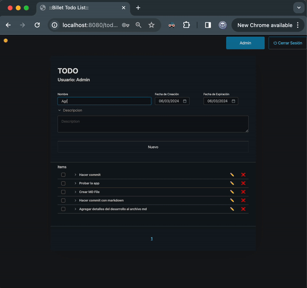
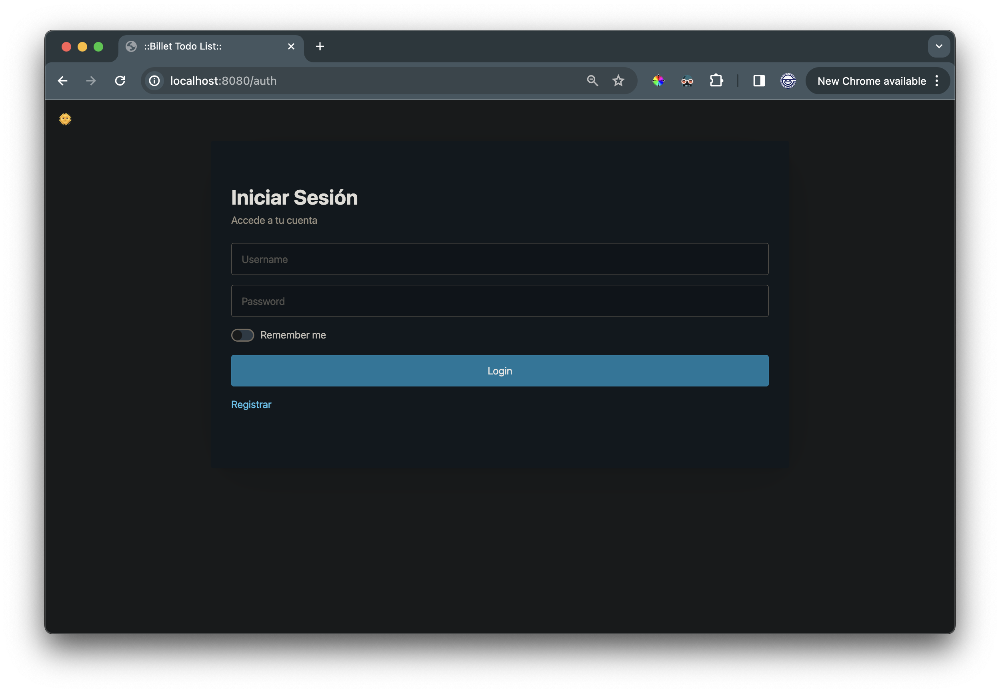
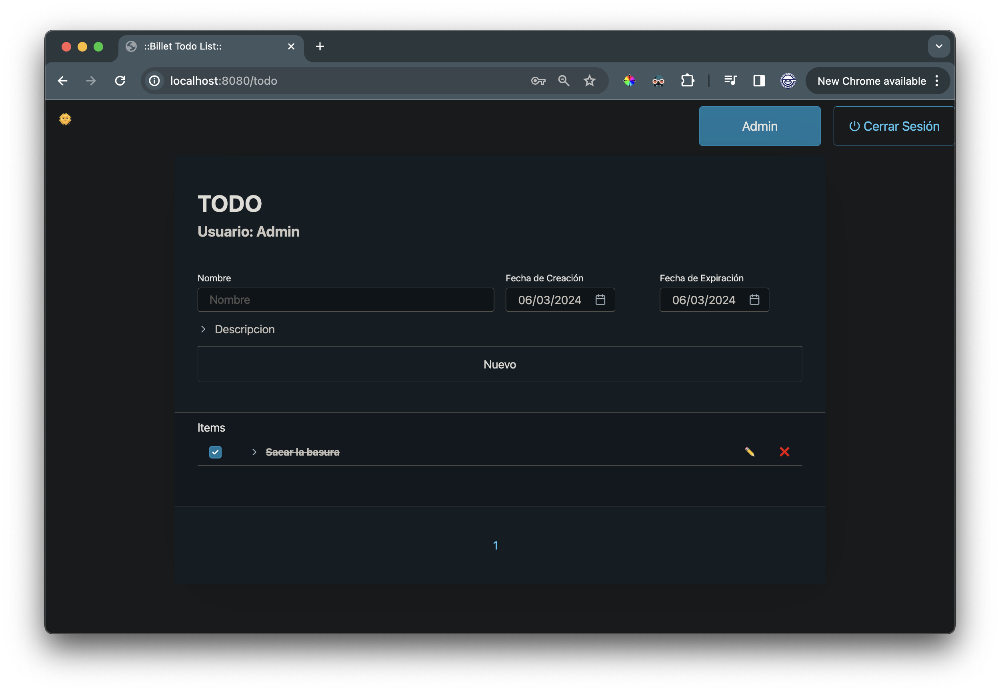
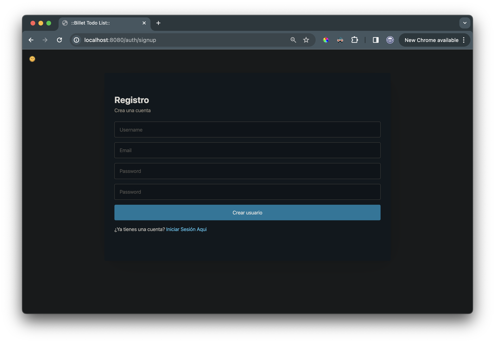
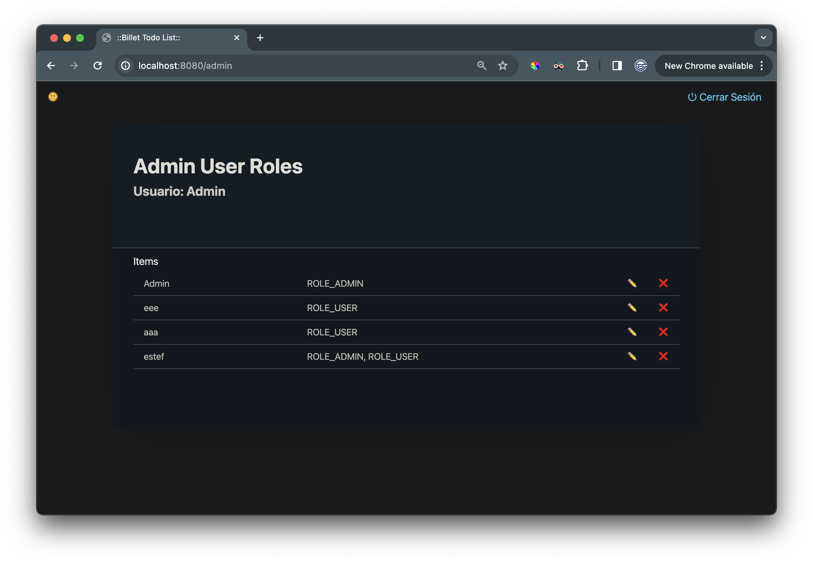
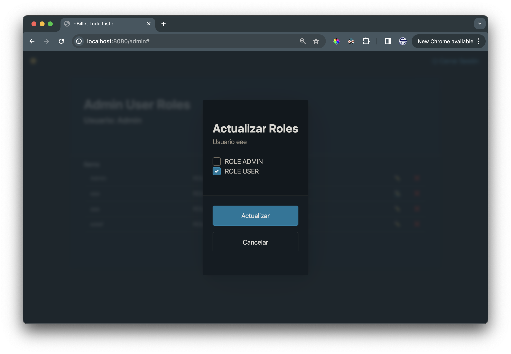

---

# TO-DO List App



Esta es una aplicación de lista de tareas desarrollada como parte de una prueba técnica. Utiliza el Spring Framework, Spring Security para la autenticación y autorización de usuarios, roles de usuario (ROLE_ADMIN, ROLE_USER), y admite paginación para una mejor experiencia de usuario.

## Características:

- **Autenticación y Autorización**: La aplicación utiliza Spring Security para la gestión de autenticación y autorización de usuarios. Los usuarios pueden tener roles de `ROLE_ADMIN` o `ROLE_USER`.

- **Gestión de Roles**: El administrador tiene la capacidad de cambiar los roles de los usuarios para controlar sus permisos en la aplicación.

- **Paginación**: Se ha implementado paginación para mejorar la experiencia de usuario al visualizar largas listas de tareas.

- **JWT (JSON Web Tokens)**: La aplicación utiliza JWT para la autenticación basada en tokens, lo que proporciona una forma segura de transmitir información de autenticación entre el cliente y el servidor.

- **Alpine.js**: Se ha utilizado la librería Alpine.js para mejorar la interactividad y la experiencia del usuario en el frontend de la aplicación.

## Requisitos del Sistema:

- Java 21
- Maven
- H2 como base de datos. Utiliza JPA, por lo que es agnóstico a bases de datos.

## Configuración y Ejecución:

1. Clona este repositorio en tu máquina local.
2. La base de datos H2 no necesita mayores configuraciones más allá de cambiar la fuente de datos en el archivo application.yml.
3. Ejecuta el siguiente comando para compilar y ejecutar la aplicación:

    ```
    mvn spring-boot:run
    ```

4. Abrir el navegador y acceder a `http://localhost:8080` para utilizar la aplicación.

## Capturas de Pantalla











